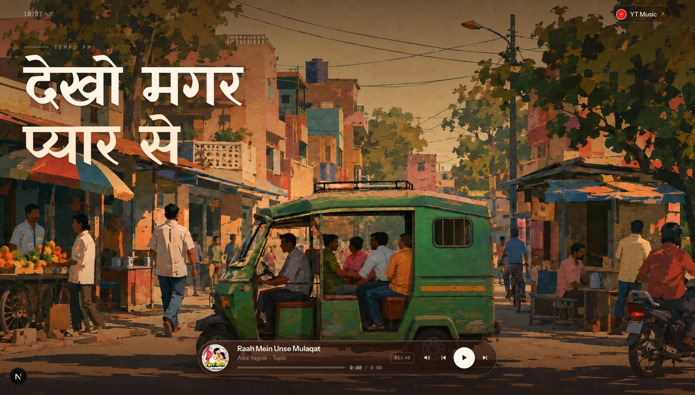
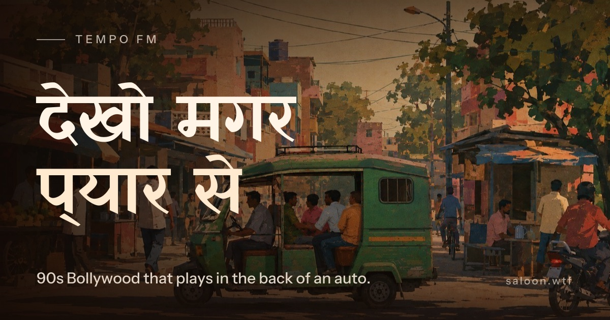
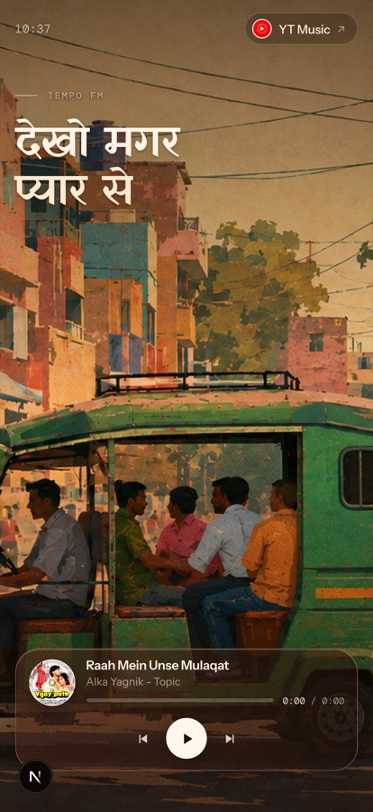

# Tempo FM

**देखो मगर प्यार से** — 90s Bollywood that plays in the back of an auto.

A single-screen radio for the songs you've heard a hundred times through a blown auto-rickshaw speaker somewhere between Indiranagar and wherever you were actually going. Point it at a YouTube playlist and it becomes a station.

Tempo FM is a sibling of **[saloon.wtf](https://saloon.wtf)** — same idea, different chair. Saloon is the barbershop; this one is the ride home.



---

## What it does

- Streams a YouTube playlist through a hidden IFrame Player — no video, just the audio and the artwork.
- Pulls titles, channels, artwork and durations from the YouTube Data API, cached for 5 minutes.
- Play / pause / skip, scrubbing, volume, and a track counter. The record keeps its rotation when you pause, and picks up from the same angle when you hit play.
- Auto-advances to the next track when one ends, and wraps around at the end of the playlist.
- Ships an Open Graph card so links posted to WhatsApp, iMessage or Twitter unfurl properly.

<p align="center">
  
</p>

## Design

Warm, dusk-lit, single screen. Full-bleed illustration; everything else floats on top of it.

- **[Yatra One](https://fonts.google.com/specimen/Yatra+One)** for the Devanagari display type — a face drawn after Indian street signage, which is more or less exactly what the line on the back of an auto is.
- **[Instrument Sans](https://fonts.google.com/specimen/Instrument+Sans)** for interface text, **[DM Mono](https://fonts.google.com/specimen/DM+Mono)** for the clock, timestamps and counter.
- The player is real glass — `backdrop-filter` over the artwork, not a flat translucent panel. The background stays sharp so the illustration keeps its detail.
- Scrims and grain are layered separately from the image so contrast can be tuned without touching the art.

<p align="center">
  
</p>

## Running it

```bash
npm install
cp .env.example .env      # then fill in the two values below
npm run dev
```

| Variable | What it's for |
| --- | --- |
| `NEXT_PUBLIC_YOUTUBE_PLAYLIST_URL` | Any public YouTube playlist URL. The `list=` ID is extracted from it, and the header link points here. |
| `YOUTUBE_DATA_API_KEY` | A YouTube Data API v3 key, server-side only. Restrict it to the YouTube Data API in Google Cloud. |
| `NEXT_PUBLIC_SITE_URL` | Optional. The canonical origin, used to resolve absolute Open Graph URLs. Set automatically on Vercel. |

`.env` is gitignored. The API key is never sent to the browser — playlist fetching happens in `app/api/playlist/route.ts` on the server.

## Deploying

Built for Vercel. Push the repo, import it, add the three environment variables, deploy. `NEXT_PUBLIC_SITE_URL` can be left unset there — Vercel's production URL is picked up automatically.

## Layout

```
app/
  page.tsx              hero, top bar, player placement
  layout.tsx            fonts, metadata, share card wiring
  globals.css           backdrop layers, scrims, grain, type scale
  opengraph-image.tsx   1200×630 share card, rendered at build time
  api/playlist/route.ts YouTube Data API → track list
  _assets/              fonts and artwork used by the share card only
components/
  Clock.tsx             the local time in the corner
  TempoPlayer/          the glass player and everything it does
```

## Swapping the station

The line on the hero is two `<span>`s in `app/page.tsx`, the illustration is `public/bg.png`, and the palette lives in the `:root` block of `app/globals.css`. Change those three and it's a different city.

---

Built by [Siddhanth Kapoor](https://github.com/SiddhanthKapoor).
